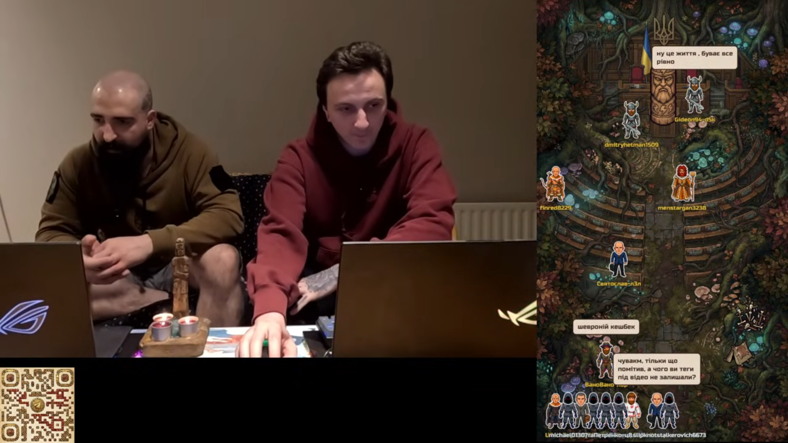
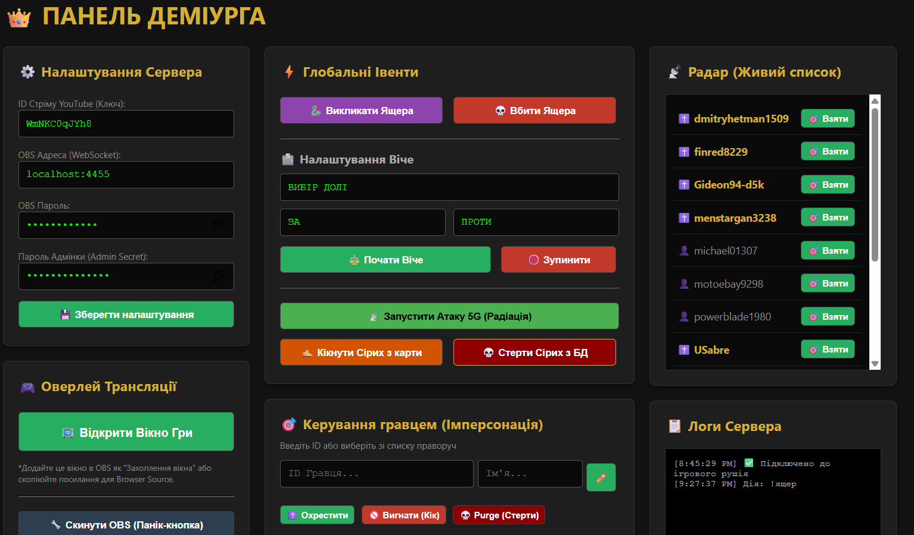

# Votan

[](https://github.com/uinjad/Votan/actions/workflows/ci.yml)

Votan turns a live YouTube chat into a multiplayer RPG that runs as an overlay
on top of the stream. Viewers play by typing chat commands — nothing to
install, no extensions, no logins. It also drives OBS directly, so boss fights,
votes and visual effects fire on stream in real time.

The theme is a satirical, chat-driven game built around internet conspiracy
memes (5G, lizard people, and friends). The setting is a joke; the engine
isn't.



## How it works

One Go process runs three things at once:

- a fixed 100 ms tick loop that owns all game state — movement, collisions,
  voting, timed events;
- a chat reader that pulls the YouTube live chat feed and pushes commands into
  a buffered channel;
- a WebSocket server that streams game state to the overlay and the admin
  dashboard ten times a second.

State sits behind a single `sync.RWMutex` and is only mutated from the tick
loop. The chat reader and the WebSocket clients never touch it directly — they
talk to the loop over channels. Each tick drains a length snapshot of the
command channel, which gives natural backpressure when a stream gets loud.

The domain model and the wire model are kept apart: `Player` is the in-memory
entity, `PlayerState` is the JSON the frontend gets.

## Design notes

A few decisions worth calling out:

- **Dependency inversion.** The engine depends on two small interfaces it owns
  itself — `Store` (persistence) and `Scene` (OBS) — not on concrete types. The
  SQLite and OBS packages implement those interfaces; the engine never imports
  them. A `nil` dependency is normalised to a no-op implementation, so the game
  runs fully headless (which is exactly how the tests drive it) without a single
  nil check on the hot path.

- **Persistence never blocks the loop.** Writes are fire-and-forget: the store
  hands them to a single background goroutine over a buffered channel and
  returns immediately, so a slow disk can never stall a tick. That one goroutine
  also serialises every write, which keeps SQLite happy. The in-memory state is
  authoritative; the database is a convenience for surviving restarts. Under
  extreme load the queue sheds writes (and logs it) rather than blocking the
  game.

- **Restart-safe board.** On startup every persisted user is loaded once into an
  in-memory cache; players whose saved tile is still free are placed back on the
  board, so a restart preserves positions, skins and "baptism" status. First
  contact from a returning viewer is served from that cache — no database read
  in the request path.

- **Graceful shutdown.** `main` builds a `signal.NotifyContext`; Ctrl+C or
  SIGTERM cancels it, which unwinds everything in order — the HTTP server drains
  via `Shutdown`, the game loop and chat reader return on the cancelled context,
  live WebSocket connections close, and finally the queued DB writes are flushed
  before the database is closed.

- **OBS fade cancellation.** OBS fades run in their own goroutines, and a global
  generation counter lets any new effect cancel a stale fade still in flight, so
  two overlapping admin actions can't leave the scene stuck half-faded.



## Stack

- Go 1.25
- `gorilla/websocket` for the realtime layer
- `glebarez/go-sqlite` — pure-Go, CGO-free SQLite, so it cross-compiles cleanly
- `andreykaipov/goobs` for the OBS WebSocket API
- `log/slog` for structured logging
- vanilla JS + HTML5 canvas for the overlay and the dashboard

## Running it

Needs Go 1.25+ and, optionally, OBS Studio with its WebSocket server enabled.

```
git clone https://github.com/uinjad/Votan.git
cd Votan
make run
```

Add a Browser Source in OBS pointing at `http://127.0.0.1:8080`, and open
`http://127.0.0.1:8080/admin.html` for the control panel. Config (stream id,
OBS address/password, admin token) lives in `.env` and can be edited from the
panel. The listen address can be overridden with `LISTEN_ADDR` in `.env`.

```
make test      # run the engine tests
make build     # build the binary
make release   # build and package a zip with assets
```

## Chat commands

Viewers move and act by typing in chat:

- `!r5` `!l2` `!u10` `!d` — move right / left / up / down N tiles
- `!hit` — damage the active boss during a boss event
- `!h1b2` — change head / body skin (needs an admin "baptism" first)

## Tests

The engine logic is covered by unit tests — movement and collision rules, the
vote tally, AFK cleanup, timed debuffs, command parsing, admin auth — plus a
race-detector test that hammers the command channel and state reads while the
loop runs. Everything runs against a headless game with no DB and no OBS:

```
go test -race ./...
```

## Known limitations

This is built to run locally for a single streamer, and the security model
reflects that. The server **binds to loopback (`127.0.0.1`) by default**, so the
admin panel and the `/api/config` endpoint — which expose the local OBS and
admin secrets to the operator's own browser — are not reachable from the
network. The admin channel is gated by a shared token compared in constant time,
and the WebSocket accepts any origin (safe behind the loopback bind). Putting
this on the open internet would need real auth, proper origin checks, and a
config endpoint that never ships secrets to the client.

## Roadmap

- [x] Unit tests for movement, collisions and voting
- [x] Graceful shutdown, dependency injection, async persistence
- [ ] Flipper Zero / Bluetooth HID control of entities from the dashboard
- [ ] Twitch and Kick chat alongside YouTube